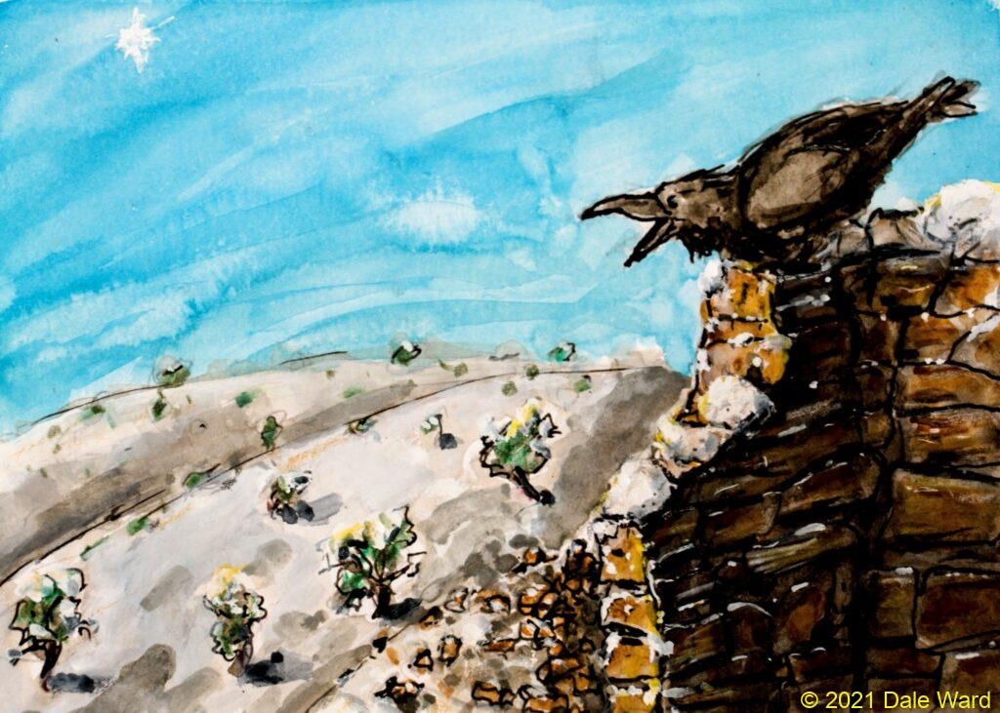

<figure>

<figcaption>

Ruins in a snowy day

</figcaption>

</figure>

I wish you all a Happy New Year. May the coming year treat you and your loved ones well.

As I write this, Louisville and Superior, Colorado, are burning…in a _Winter_\-_time_ _wildfire_. At least five or six hundred homes have been destroyed. I don’t know whether there have been lives lost. I hope not.

Yet we argue about climate change.

SARSCOV2 is rampant. Yet wearing a mask or getting a vaccine are seen as a political statements.

I could go on (and on), but you likely get the idea.

Our country has deep political divides, fueled by Left- and Right-wing media that are pitting us against each other. As though we are ants in a jar that they shake, trying to get us to fight with each other.

I don’t have a quick solution for any of these problems. But here’s what I’m going to try to do.

Maybe try to be more kind in the coming year. Don’t assume the worst of people, cut them a break. Smile at strangers, say hello them. Try to help them.

Don’t assume that you are correct about the things you believe. Listen respectfully to people, think about what they say. Even those with whom you disagree. Don’t follow leaders, watch your parking meters.

If you are in a warm, dry home and have enough food, be grateful.

And my thanks to Bob Dylan for the quotation.
